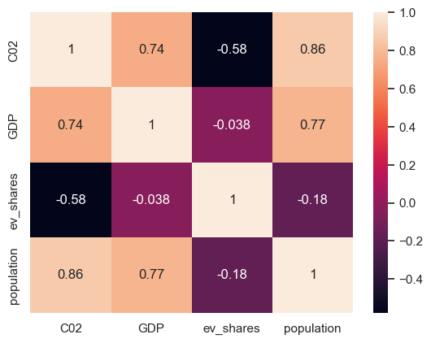
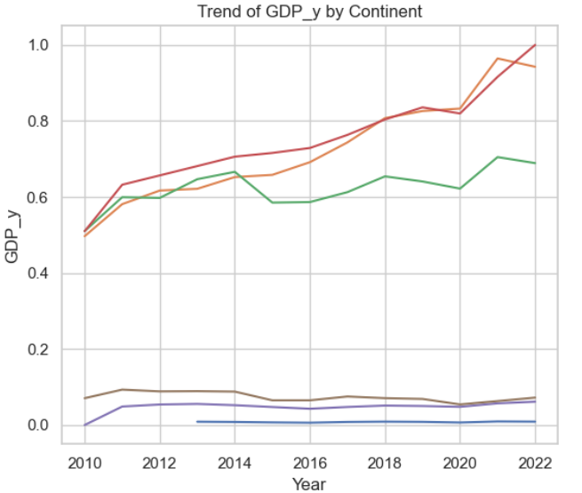

# Correlation between CO2, Population, EV Sales, and GDP

## Does the consumption of electric cars have an impact on pollution?

This Data Analysis project gathers data from various reliable sources such as:
- [Our World in Data](https://ourworldindata.org)
- [World Bank](https://worldbank.org)

The project is organized into folders:

- In the [src](./src) directory, you will find the code used to fetch information through API calls or to clean JSON files.
- The [data](./data) directory contains two subfolders: [raw](./data/raw) and [cleaned](./data/cleaned). Here, you will find the raw data and the cleaned dataset, respectively, which are ready for data analysis.

The main analysis and visualizations can be found in the [main.ipynb](./data/cleaned/main.ipynb) notebook. This notebook includes the primary code used to generate the graphs for data analysis.

## Conclusion:

The following visualizations demonstrate the correlation between the variables:

.png)
.png)
.png)

From the graphs, we can observe the correlation between the variables. In countries with policies favorable to renewable energy, CO2 levels decrease. Conversely, in countries lacking environmental policies, CO2 levels increase. Thus, the consumption of electric vehicles does not have a direct correlation with CO2 levels alone.

This project highlights the importance of comprehensive environmental policies over individual actions such as the purchase of electric vehicles. While EVs contribute to reducing emissions, broader policies and systemic changes are crucial for significant CO2 reduction.

By analyzing the data, we aim to provide insights into how different factors like population, GDP, and the adoption of electric vehicles interact with CO2 emissions, underscoring the complexity of addressing climate change.
